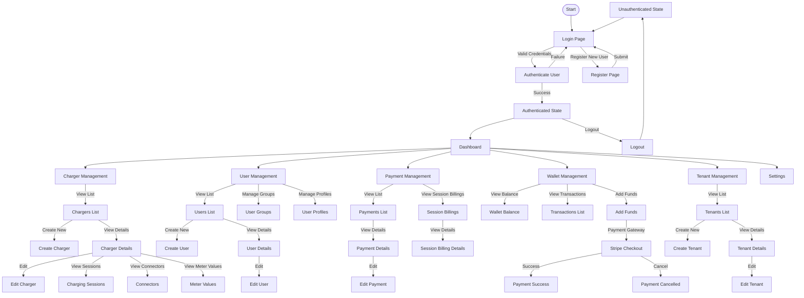

# JoulePoint EV Charging Platform - Application Documentation

## Table of Contents

1. [React App Implementation Overview](#react-app-implementation-overview)
2. [Project Structure](#project-structure)
3. [Modules and Components](#modules-and-components)
4. [API Integration Summary](#api-integration-summary)
5. [Application Flow Diagram](#application-flow-diagram)
6. [Pages and Navigation Diagram](#pages-and-navigation-diagram)
7. [Technology Stack](#technology-stack)
8. [Key Development Considerations](#key-development-considerations)

## React App Implementation Overview

JoulePoint is a comprehensive EV charging management platform built with React, TypeScript, and modern web technologies. The application enables users to manage electric vehicle charging infrastructure, including chargers, user accounts, payments, and session data.

### Architecture Overview

The application follows a modular architecture organized around distinct business domains:

- **Feature-based organization**: Code is organized by business domains (chargers, users, payments, etc.)
- **Component-based development**: UI is built using reusable components
- **Container/Presentation pattern**: Many components are split between container components (with logic) and presentation components
- **Context API**: Used for global state management (authentication, tenant contexts)
- **Custom hooks**: Encapsulate and reuse complex logic

### State Management

The application uses a hybrid approach to state management:

- **React Query**: For server state management, data fetching, caching and synchronization
- **React Context API**: For global application state (auth, tenant information)
- **Redux**: For specific complex state management needs
- **Local component state**: For UI-specific state

### API Integration

- **Service Layer**: API calls are abstracted in service modules
- **API Client**: Axios is used for HTTP requests
- **Custom Hooks**: Wrap service calls in React Query hooks

## Project Structure

```
src/
├── components/        # Reusable UI components
│   ├── ui/            # Base UI components (buttons, inputs, etc.)
│   ├── layout/        # Layout components (sidebar, header, etc.)
│   ├── charger/       # Charger-specific components
│   ├── user/          # User-specific components
│   └── payments/      # Payment-specific components
├── contexts/          # React contexts for global state
├── hooks/             # Custom React hooks
├── lib/               # Utility libraries and configuration
├── pages/             # Page components organized by route
├── services/          # API service modules
├── types/             # TypeScript type definitions
└── utils/             # Utility functions
```

## Modules and Components

### Core Infrastructure

| Module | Description |
|--------|-------------|
| **Authentication** | User authentication and authorization |
| **Tenant Management** | Multi-tenant functionality and configuration |
| **Layout System** | Page layouts, navigation, and UI structure |

### Domain-Specific Modules

| Module | Description |
|--------|-------------|
| **Charger Management** | CRUD operations for chargers, connector configuration |
| **User Management** | User accounts, profiles, and permissions |
| **Payment Processing** | Payment handling, transactions, and session billing |
| **Wallet Management** | User wallet functionality and balance management |
| **OCPI Integration** | Open Charge Point Interface integration |
| **Reporting** | Analytics and reporting functionality |

### Key Components

#### Layout Components
- **AppLayout**: Main authenticated application layout
- **GuestLayout**: Layout for unauthenticated users
- **Sidebar**: Main navigation sidebar
- **Header**: Application header with user controls

#### Charger Components
- **ChargerTable**: Displays list of chargers 
- **ChargerDetailCard**: Shows detailed information about a charger
- **ChargerForm**: Form for creating/editing chargers
- **ConnectorTable**: Displays charger connectors
- **ChargingSessionTable**: Displays charging sessions

#### User Components
- **UserTable**: Displays list of users
- **UserDetailCard**: Shows detailed information about a user
- **UserForm**: Form for creating/editing users
- **GroupTable**: Displays user groups

#### Payment Components
- **PaymentTable**: Displays list of payments
- **PaymentDetail**: Shows detailed information about a payment
- **PaymentForm**: Form for editing payment information
- **PaymentBadge**: Visual indicator for payment status
- **SessionBillingTable**: Displays session billing information

#### Wallet Components
- **WalletBalanceCard**: Displays wallet balance
- **TransactionsList**: Shows transaction history
- **AddFundsForm**: Form for adding funds to wallet

#### UI Components
- **Button**: Standard button component
- **Input**: Text input component
- **Select**: Dropdown select component
- **Table**: Data table component
- **Card**: Card container component
- **Dialog**: Modal dialog component
- **Tabs**: Tabbed content component
- **Form**: Form components and validation

## API Integration Summary

### Authentication APIs

| Endpoint | Method | Description | Used In |
|----------|--------|-------------|---------|
| `/api/token/` | POST | User login | AuthContext, Login page |
| `/api/token/refresh/` | POST | Refresh access token | AuthContext |
| `/api/token/verify/` | POST | Verify token validity | AuthContext |
| `/api/logout/` | POST | User logout | AuthContext |

### User Management APIs

| Endpoint | Method | Description | Used In |
|----------|--------|-------------|---------|
| `/users/users/` | GET | List all users | UserManagement page, useUser hook |
| `/users/users/:id/` | GET | Get user details | UserDetail page, useUser hook |
| `/users/users/` | POST | Create new user | UserForm, useUser hook |
| `/users/users/:id/` | PUT | Update user | UserForm, useUser hook |
| `/users/users/:id/` | DELETE | Delete user | UserManagement page, useUser hook |
| `/users/profiles/` | GET | List all profiles | ProfileManagement page |
| `/users/profiles/:id/` | GET | Get profile details | ProfileDetail page |

### Charger Management APIs

| Endpoint | Method | Description | Used In |
|----------|--------|-------------|---------|
| `/ocpp/chargers/` | GET | List all chargers | ChargerManagement page, useCharger hook |
| `/ocpp/chargers/:id/` | GET | Get charger details | ChargerDetail page, useCharger hook |
| `/ocpp/chargers/` | POST | Create new charger | ChargerForm, useCharger hook |
| `/ocpp/chargers/:id/` | PUT | Update charger | ChargerForm, useCharger hook |
| `/ocpp/charging-sessions/` | GET | List charging sessions | ChargingSessionsManagement page |
| `/ocpp/connectors/` | GET | List connectors | ConnectorTable component |

### Payment APIs

| Endpoint | Method | Description | Used In |
|----------|--------|-------------|---------|
| `/users/payments/` | GET | List all payments | PaymentManagement page, usePayments hook |
| `/users/payments/:id/` | GET | Get payment details | PaymentDetail page, usePayments hook |
| `/users/payments/:id/` | PUT | Update payment | PaymentForm, usePayments hook |
| `/users/session-billings/` | GET | List session billings | SessionBillingTable component |
| `/users/session-billings/:id/` | GET | Get session billing details | SessionBillingDetail page |

### Wallet APIs

| Endpoint | Method | Description | Used In |
|----------|--------|-------------|---------|
| `/users/wallets/` | GET | List wallet transactions | WalletsPage, useWallets hook |
| `/users/wallets/balance/` | GET | Get wallet balance | WalletBalanceCard component |
| `/users/razorpay/create_wallet_deposit_order/` | POST | Create deposit order | AddFundsForm component |
| `/users/razorpay/handle_payment_success/` | POST | Handle successful payment | AddFundsForm component |

### Tenant Management APIs

| Endpoint | Method | Description | Used In |
|----------|--------|-------------|---------|
| `/tenant/clients/` | GET | List all tenants | TenantManagement page, useTenant hook |
| `/tenant/clients/:id/` | GET | Get tenant details | TenantDetail page, useTenant hook |
| `/tenant/clients/` | POST | Create new tenant | TenantForm, useTenant hook |
| `/tenant/clients/:id/` | PUT | Update tenant | TenantForm, useTenant hook |
| `/tenant/domains/` | GET | List domains | DomainTable component |

## Application Flow Diagram



## Pages and Navigation Diagram

```mermaid
graph TD
    root[Root / App] --> guest{Guest?}
    guest -->|Yes| guestLayout[Guest Layout]
    guest -->|No| appLayout[App Layout]
    
    %% Guest routes
    guestLayout --> login[Login]
    guestLayout --> register[Register]
    
    %% Authenticated routes
    appLayout --> dashboard[Dashboard]
    
    %% Tenant Management
    appLayout --> tenants[Tenant Management]
    tenants --> tenantDetail[Tenant Detail]
    tenantDetail --> tenantEdit[Edit Tenant]
    tenants --> tenantCreate[Create Tenant]
    tenants --> tenantDomains[Tenant Domains]
    tenants --> tenantApps[Tenant Apps]
    
    %% Charger Management
    appLayout --> chargers[Charger Management]
    chargers --> chargerDetail[Charger Detail]
    chargers --> chargerConfigs[Charger Configs]
    chargers --> chargingSessions[Charging Sessions]
    chargers --> meterValues[Meter Values]
    chargers --> idTags[ID Tags]
    appLayout --> remoteCommands[Remote Commands]
    
    %% User Management
    appLayout --> users[User Management]
    users --> userDetail[User Detail]
    users --> userGroups[User Groups]
    
    %% Profile Management
    appLayout --> profiles[Profile Management]
    profiles --> profileDetail[Profile Detail]
    
    %% Payment Management
    appLayout --> payments[Payment Management]
    payments --> paymentDetail[Payment Detail]
    paymentDetail --> paymentEdit[Edit Payment]
    payments --> sessionBillingDetail[Session Billing Detail]
    
    %% Plan Management
    appLayout --> plans[Plan Management]
    plans --> planDetail[Plan Detail]
    
    %% Promotion Management
    appLayout --> promotions[Promotion Management]
    promotions --> promotionDetail[Promotion Detail]
    
    %% Wallets
    appLayout --> wallets[Wallets]
    wallets --> walletDetail[Wallet Detail]
    
    %% Devices
    appLayout --> devices[Device Management]
    devices --> deviceDetail[Device Detail]
    
    %% OCPI Management
    appLayout --> ocpi[OCPI Management]
    ocpi --> ocpiDetail[OCPI Detail]
    
    %% Reports
    appLayout --> reports[Reports]
    reports --> usageReport[Usage Report]
    reports --> revenueReport[Revenue Report]
    reports --> activityReport[Activity Report]
    
    %% Notifications
    appLayout --> notifications[Notifications]
    notifications --> emailNotifications[Email Notifications]
    notifications --> smsNotifications[SMS Notifications]
    notifications --> notificationHistory[Notification History]
    
    %% Settings
    appLayout --> settings[Settings]
```



## Technology Stack

### Core Technologies
- **React**: JavaScript library for building user interfaces
- **TypeScript**: Typed superset of JavaScript
- **Vite**: Build tool and development server

### UI Libraries
- **Tailwind CSS**: Utility-first CSS framework
- **Shadcn/UI**: Component library built on Radix UI
- **Lucide React**: Icon library
- **React Router**: Navigation and routing

### State Management
- **@tanstack/react-query**: Data fetching, caching, and state management
- **React Context API**: Global state management for auth and tenant info
- **Redux Toolkit**: State management for complex application state

### API Integration
- **Axios**: HTTP client for API requests

### Data Visualization
- **Recharts**: Composable charting library for reports and dashboards

### Form Handling
- **React Hook Form**: Form state management and validation
- **Zod**: Schema validation library

### Other Libraries
- **date-fns**: Date utility library
- **clsx/tailwind-merge**: CSS class name utilities
- **Sonner**: Toast notification system

## Key Development Considerations

### Authentication Flow
The application uses JWT (JSON Web Token) authentication with access and refresh tokens. The refresh token mechanism automatically refreshes access tokens when they expire.

### Multi-tenancy
The application supports multiple tenants with separate data and configurations. The tenant context determines the API endpoints and application behavior based on the current tenant.

### Responsive Design
All pages and components are designed to be responsive, supporting both desktop and mobile views.

### Error Handling
The application implements comprehensive error handling at multiple levels:
- API request error handling in service modules
- Error boundaries for React components
- User-friendly error messages with toast notifications

### Data Caching and Synchronization
React Query is used for efficient data fetching with built-in caching, refetching, and synchronization capabilities.

### Code Organization
- **TypeScript interfaces**: Define data structures and API responses
- **Service layer**: Abstracts API calls from UI components
- **Custom hooks**: Encapsulate complex logic and data fetching
